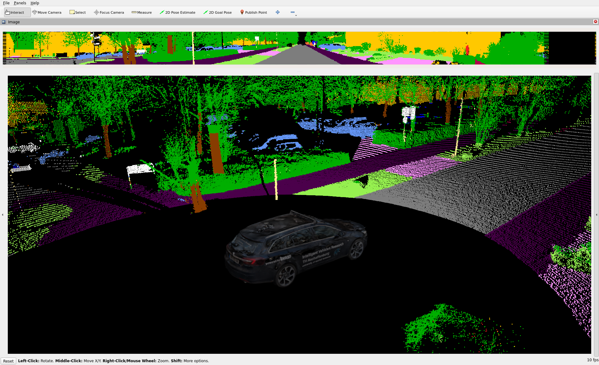

# Semantic_LiDAR_ROS

A docker container with ROS2 and a ROS2 Package for LiDAR semantic segmentation


## Development environment:

### VS-Code:
The project is designed to be delevoped within vs-code IDE using remote container development.

### Setup Docker Container
```bash
# Enable xhost in the terminal
sudo xhost +

# Add user to environment
sh setup.sh

# Build the image from scratch using Dockerfile, can be skipped if image already exists or is loaded from docker registry
docker-compose build --no-cache

# Start the container
docker-compose up -d

# Stop the container
docker-compose down
```

### Set Up in VS Code
#### Possibility 1: (Preferred)

#### 1. Step: Executing the first task "rviz start" to start rviz 
Hit menu item "Terminal" and chose "Run Task...":
 -> execute the task "rviz start" -> Rviz window opens 
 
#### 2. Step: Executing second task "SemanticLiDAR start" to start the Semantic Node: 
Hit menu item "Terminal" and chose "Run Task...":
 -> execute the task "SemanticLiDAR start" -> Rviz window shows the output of the semantic node


#### Possibility 2: 
In VS Code open two terminals:
```bash
# Terminal 1, start RVIZ
appuser@taurus:~/ros2_ws$ source /opt/ros/humble/setup.bash
appuser@taurus:~/ros2_ws$ source install/local_setup.bash
appuser@taurus:~/ros2_ws$ ros2 run rviz2 rviz2 -d semantic_lidar.rvizsemantic

# Terminal 2, start SemanticLiDAR Node
appuser@taurus:~/ros2_ws$ source /opt/ros/humble/setup.bash
appuser@taurus:~/ros2_ws$ source install/local_setup.bash
appuser@taurus:~/ros2_ws$ colcon build
appuser@taurus:~/ros2_ws$ ros2 run semantic_lidar_package semantic_lidar_node
```
### Assets:


<a name="license"></a>
## License:
This project is licensed under the Apache 2.0 License - see the [LICENSE](LICENSE) file for details. Note that the data, assets, and models are provided by a different licence!
